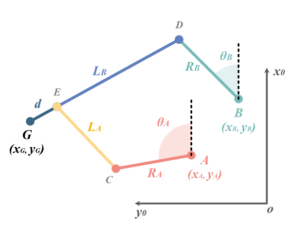
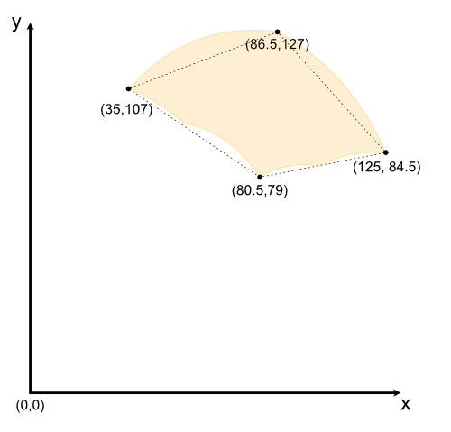

# Otis - the handwriting tool for Reachy 2019


## Software installation

* From Pypi: ```pip install reachy-otis```
* Or from the source: ```pip install -e otis_folder```

## Mechanism



Link parameters:
- RA = 30mm
- RB = 30mm
- LA = 60mm
- LB = 50mm
- d = 15mm
- A (40mm , 45mm)
- B (90mm, 35mm)

The forward function is defined [here](https://github.com/pollen-robotics/otis/blob/main/otis/kinematics.py#L48) and the inverse function [here](https://github.com/pollen-robotics/otis/blob/main/otis/kinematics.py#L100)

## Reacheable space
Here is the reachable space for the otis hand (value in mm). Origin is the wrist rotation axis.


A SVG file is available in /doc

## Mechanics (CAD)

You can get acces to all CAD file on our OnShape account => https://cad.onshape.com/documents/bc0741d6e41e05a3a7a83404/

## Licence

The software is open-sourced and released under an [Apache License v2.0](./software/LICENSE).

Visit [pollen-robotics.com](https://pollen-robotics.com) to learn more or visit [our forum](https://forum.pollen-robotics.com).

Follow [@PollenRobotics](https://twitter.com/pollenrobotics) on Twitter for important announcements.

This project adheres to the Contributor [code of conduct](https://github.com/pollen-robotics/reachy/blob/master/CODE_OF_CONDUCT.md). By participating, you are expected to uphold this code. Please report unacceptable behavior to [contact@pollen-robotics.com](mailto:contact@pollen-robotics.com).
